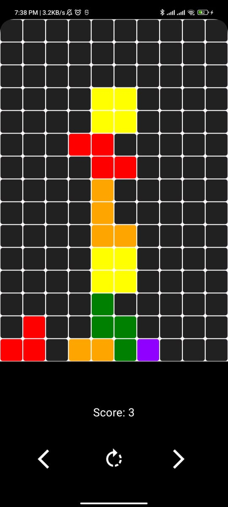
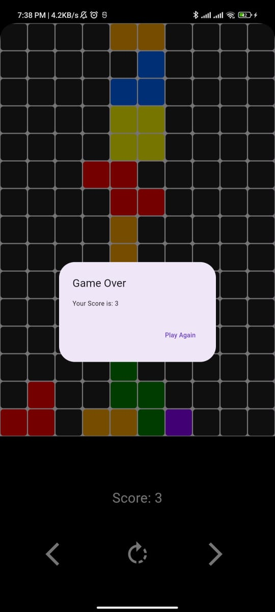

# CubicCraze

CubicCraze is a block puzzle game inspired by the classic game Tetris. The goal of the game is to fit different shapes of blocks, called "tetrominoes," into a grid without leaving gaps. Complete a line to clear it and earn points. The game ends when there's no more space to fit the incoming tetrominoes.

## How to Play

1. Blocks of different shapes called tetrominoes will fall from the top of the screen.
2. You can move the tetrominoes left or right and rotate them to fit into the grid below.
3. Once a tetromino lands, the next one will start falling.
4. Clear lines by filling the entire row with blocks.
5. The game ends when the blocks reach the top of the screen.

## Screenshots

   

## Features

- Classic block puzzle gameplay
- Intuitive controls
- Scoring system

## Installation

To play CubicCraze, download the game from the [Releases](https://github.com/aryamanshrivastava/CubicCraze) page and install it on your device.

